<div align="center">

  <!-- BANNER VECTORIAL DINÁMICO (Carga 100% online y nítido sin necesidad de subir archivos locales) -->
  

  <!-- TERMINAL TYPING DINÁMICO EN TIEMPO REAL -->
  <a href="https://jahm1997.com">
    
  </a>

  <br/><br/>

  <!-- ENLACES PRINCIPALES Y SITIOS WEB ACTIVOS -->
  <a href="https://jahm1997.com" target="_blank">
    
  </a>
  <a href="https://josephangelherreramantilla.com" target="_blank">
    
  </a>
  <a href="https://services.josephangelherreramantilla.com" target="_blank">
    
  </a>
  <a href="https://www.linkedin.com/in/joseph-angel-herrera-mantilla/" target="_blank">
    
  </a>
  <a href="mailto:jahm1997@gmail.com">
    
  </a>

</div>

<br/>

```bash
jahm1997@edge-cluster:~$ systemctl status jahm-architecture.service
```

```yaml
● jahm-architecture.service - Production Platform & Industrial IoT Engine
     Loaded: loaded (/etc/systemd/system/jahm.service; enabled; vendor preset: enabled)
     Active: active (running) since 1997 [Continuous Deployment]
   Engineer: Joseph Ángel Herrera Mantilla
   Websites: https://jahm1997.com · https://josephangelherreramantilla.com
   Platform: https://services.josephangelherreramantilla.com (Multi-Tenant Live)
   Domains:  OT Field Instrumentation ➔ Real-Time Ingestion ➔ Distributed Backend ➔ Cloud Resiliency
     Status: "Handling real-time industrial telemetry & zero-downtime microservices"
```

---

### 🌐 Arquitectura de Flujo End-to-End (OT ➔ IT)

```mermaid
%%{init: {'theme': 'dark', 'themeVariables': { 'darkMode': true, 'background': '#0d1117', 'primaryColor': '#161b22', 'primaryTextColor': '#f0f6fc', 'primaryBorderColor': '#30363d', 'lineColor': '#58a6ff' }}}%%
flowchart LR
    A(["<b>1. Capa OT & Sensores</b><br/><i>PLCs · Sensores · Modbus</i>"]) -.-> B(["<b>2. Ingesta & Streaming</b><br/><i>MQTT Broker · WebSockets</i>"])
    B -.-> C(["<b>3. Microservicios Core</b><br/><i>Node.js · Python · Multi-Tenant</i>"])
    C -.-> D(["<b>4. Persistencia Dual</b><br/><i>PostgreSQL · MongoDB · Redis</i>"])
    D -.-> E(["<b>5. Cloud & Orquestación</b><br/><i>Docker · Nginx · Zero-Downtime</i>"])
    E -.-> F(["<b>6. Frontend & Control</b><br/><i>React Dashboards · Tiempo Real</i>"])

    classDef default fill:#161b22,stroke:#30363d,stroke-width:1.5px,color:#f0f6fc;
    classDef active fill:#152238,stroke:#388bfd,stroke-width:2.5px,color:#ffffff;
    class C active;
```



> **Criterio de Ingeniería Híbrido:** Diseño de soluciones que conectan la instrumentación física en planta (sensores, PLCs, telemetría continua) con arquitecturas de microservicios distribuidos, garantizando resiliencia, aislamiento multi-inquilino y visualización en tiempo real sin saturar la red operativa.

---

### 🚀 Hitos de Producción & Arquitectura Crítica

* **⚡ Reestructuración Multi-Tenant sin Caída (Zero-Downtime):** Reorganización profunda de plataforma industrial en producción continua 24/7 sin interrumpir la operación de los clientes ni perder paquetes de telemetría.
* **📡 Pipeline de Ingestión en Tiempo Real:** Diseño y desacoplamiento de microservicios de ingesta industrial capaces de procesar flujos continuos de datos vía **MQTT**, **WebSockets** y sockets TCP directamente desde gateways de campo y routers MikroTik.
* **🛡️ Hardening e Infraestructura Perimetral:** Gestión de servidores Linux híbridos (Cloud AWS & On-Premise), contenedores Docker, proxy inverso con Nginx, aislamiento de red por VLANs y automatización de certificados SSL/TLS.
* **🏭 Background Operativo Real:** Experiencia previa directa en control automatizado y operación de plantas industriales químicas y de manufactura (Andercol / Phoenix), proporcionando una comprensión innata de los procesos físicos que ningún desarrollador puramente teórico posee.

---

### 🛠️ Matriz de Capacidades Técnicas

<table>
  <tr>
    <td width="22%"><b>Industrial Edge &amp; OT</b></td>
    <td>
      
      
      
      
      
    </td>
  </tr>
  <tr>
    <td><b>Backend &amp; Ingestión</b></td>
    <td>
      
      
      
      
      
    </td>
  </tr>
  <tr>
    <td><b>Persistencia &amp; Datos</b></td>
    <td>
      
      
      
    </td>
  </tr>
  <tr>
    <td><b>Cloud &amp; DevOps</b></td>
    <td>
      
      
      
      
      
    </td>
  </tr>
  <tr>
    <td><b>Frontend &amp; Control</b></td>
    <td>
      
      
      
      
    </td>
  </tr>
</table>

---

### 📊 Actividad & Métricas en Vivo

<div align="center">
  
  
</div>

<div align="center" style="margin-top: 10px;">
  
</div>

---

### 💼 Ecosistema & Contacto Directo

```ini
[Production Nodes]
Personal Website  = https://jahm1997.com
Curriculum Web    = https://josephangelherreramantilla.com
Enterprise Suite  = https://services.josephangelherreramantilla.com
Email             = jahm1997@gmail.com
LinkedIn          = https://linkedin.com/in/joseph-angel-herrera-mantilla/
Location          = Cartagena, Colombia (UTC-5)
```

<div align="center">
  <sub>Arquitectura diseñada para sistemas de alta concurrencia y telemetría continua · Joseph Herrera</sub>
</div>
