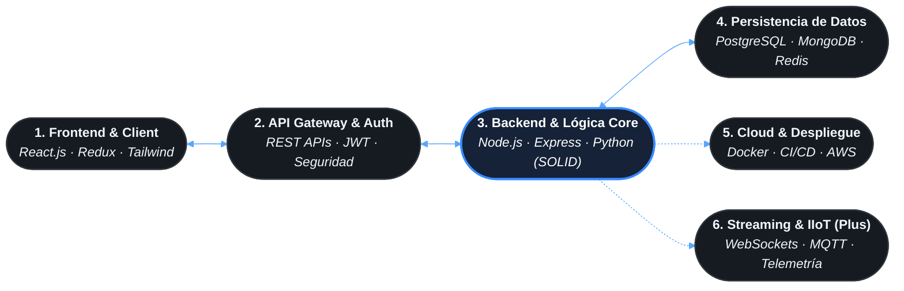

<div align="center">

  <!-- HEADER VECTORIAL DINÁMICO (WAVING GRADIENT FULL STACK DEVELOPER) -->
  

  <!-- TERMINAL TYPING DINÁMICO CENTRADO EN PROGRAMACIÓN -->
  <a href="https://jahm1997.com">
    
  </a>

  <br/><br/>

  <!-- ENLACES PRINCIPALES Y SITIOS WEB ACTIVOS -->
  <a href="https://jahm1997.com" target="_blank">
    
  </a>
  <a href="https://josephangelherreramantilla.com" target="_blank">
    
  </a>
  <a href="https://services.josephangelherreramantilla.com" target="_blank">
    
  </a>
  <a href="https://www.linkedin.com/in/joseph-angel-herrera-mantilla/" target="_blank">
    
  </a>
  <a href="mailto:jahm1997@gmail.com">
    
  </a>

</div>

<br/>

```bash
jahm1997@dev-workstation:~$ fastfetch --developer-profile
```

```yaml
DEVELOPER:      Joseph Ángel Herrera Mantilla (@jahm1997)
ROLE:           Senior Full Stack Developer / Software Engineer
MAIN_FOCUS:     Backend Core (Node.js/Python), Modern Web (React), Clean Architecture & APIs
PARADIGMS:      MVC, Principios SOLID, Programación Reactiva, Clean Code
SUPERPOWER:     Integración de Sistemas en Tiempo Real (WebSockets, IIoT, Telemetría) & Cloud
SITES:          https://jahm1997.com · https://josephangelherreramantilla.com
PHILOSOPHY:     "Software robusto, mantenible y preparado para producción desde el primer commit."
```

---

### 💻 Ciclo de Vida del Software Full Stack



> **Enfoque de Ingeniería:** Construcción de software de punta a punta con código limpio, tipado estricto y separación clara de responsabilidades (frontend responsivo y reactivo, backend modular con lógica desacoplada y persistencia optimizada).

---

### 🚀 Experiencia en Desarrollo & Buenas Prácticas

* **🧩 Arquitectura de Software Limpia:** Diseño e implementación de soluciones modulares bajo principios **SOLID** y patrones **MVC**, garantizando mantenibilidad a largo plazo y facilidad para pruebas unitarias.
* **⚡ Backend & Microservicios de Alto Rendimiento:** Desarrollo de APIs RESTful seguras, servicios de autenticación independientes y microservicios escalables en **Node.js** y **Python**.
* **🖥️ Interfaces Modernas & Reactivas:** Construcción de aplicaciones web en **React.js** con gestión de estado centralizada (**Redux**), interfaces dinámicas y optimización de renderizado en el cliente.
* **🌟 Valor Agregado Diferencial:** Capacidad para conectar el software tradicional con el mundo de datos en tiempo real (**WebSockets**, **MQTT**, ingesta industrial y contenedores **Docker** en la nube).

---

### 🛠️ Toolbox Tecnológico

<table>
  <tr>
    <td width="22%"><b>Frontend Development</b></td>
    <td>
      
      
      
      
      
    </td>
  </tr>
  <tr>
    <td><b>Backend &amp; Lógica Core</b></td>
    <td>
      
      
      
      
      
    </td>
  </tr>
  <tr>
    <td><b>Bases de Datos</b></td>
    <td>
      
      
      
    </td>
  </tr>
  <tr>
    <td><b>DevOps &amp; Cloud (Plus)</b></td>
    <td>
      
      
      
      
      
    </td>
  </tr>
  <tr>
    <td><b>Tiempo Real &amp; IIoT (Plus)</b></td>
    <td>
      
      
      
    </td>
  </tr>
</table>

---

### 📊 Actividad & Métricas en Vivo

<div align="center">
  
  
</div>

<div align="center" style="margin-top: 10px;">
  
</div>

---

### 💼 Ecosistema & Contacto Directo

```ini
[Developer Info]
Personal Website  = https://jahm1997.com
Curriculum Web    = https://josephangelherreramantilla.com
Enterprise Suite  = https://services.josephangelherreramantilla.com
Email             = jahm1997@gmail.com
LinkedIn          = https://linkedin.com/in/joseph-angel-herrera-mantilla/
Location          = Cartagena, Colombia (UTC-5)
```

<div align="center">
  <sub>Desarrollador Full Stack enfocado en código limpio, escalabilidad y arquitecturas listas para producción · Joseph Herrera</sub>
</div>
